<div align="center">

# 🖼️ Pixtract

***Extract product attributes from images — automatically.***

A demo web application that uses a vision AI model to extract structured product attributes (color, pattern, fit, closure type, etc.) from images, ready for export to Excel.


> The AI model runs on Google Colab (session-based, not a permanent server), Stripe is in test mode (no real payments), and the database uses SQL Server LocalDB (local machine only).

</div>

---

## 📋 Table of Contents

- [Overview](#overview)
- [Screenshots](#screenshots)
- [Architecture](#architecture)
- [Tech Stack](#tech-stack)
- [Features](#features)
- [How It Works — End to End](#how-it-works--end-to-end)
- [AI Service (Python)](#ai-service-python)
- [Subscription Plans](#subscription-plans)
- [Project Structure](#project-structure)
- [Database Schema](#database-schema)
- [API Endpoints](#api-endpoints)
- [Authentication](#authentication)
- [Demo Limitations](#demo-limitations)
- [Running the Project](#running-the-project)
- [Configuration](#configuration)

---

## 🔍 Overview

Pixtract solves the problem of manual product cataloguing in e-commerce. Instead of a human reading each product image and filling in attributes, the AI model does it automatically in seconds.

**📦 Supported categories:**
- Tricouri dama (Women's T-shirts)
- Tricouri barbati (Men's T-shirts)
- Tricouri copii (Children's T-shirts)
- Bluze dama (Women's blouses)
- Sandale dama (Women's sandals)
- Pantaloni sport barbati (Men's sport pants)
---

## 📸 Screenshots

### Frontend

| Landing page | Landing page |
|---|---|
| 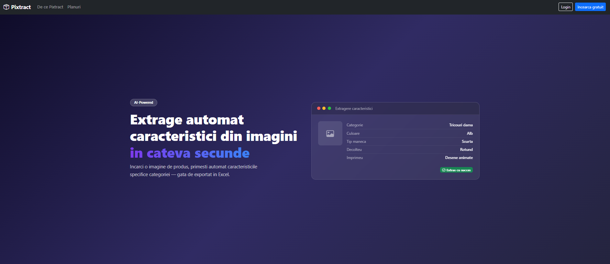 | !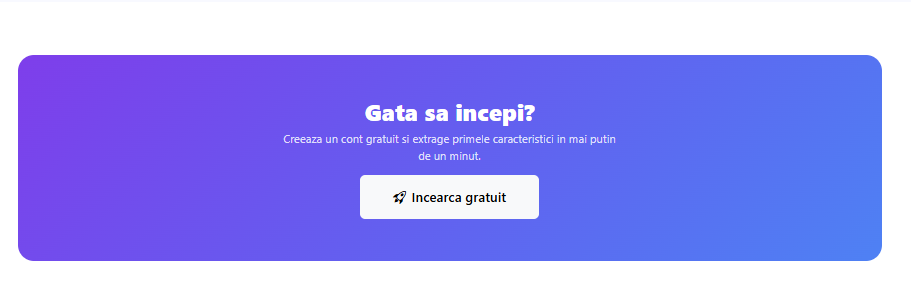 |

| Landing page | Dashboard page for a user with free plan |
|---|---|
|  | !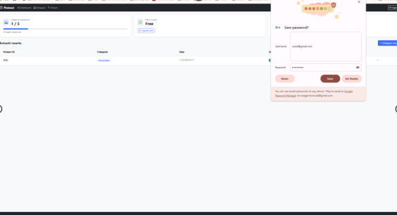 |

| Extraction | Extraction result |
|---|---|
| 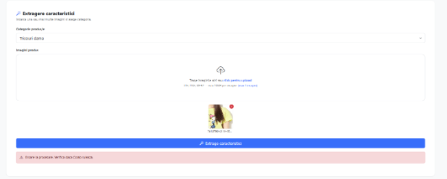 | 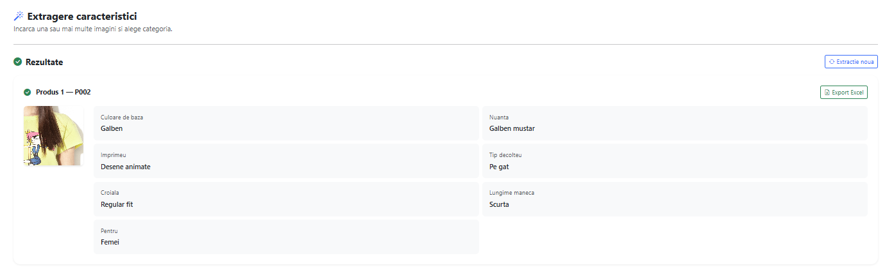 |


| Dashboard — extraction history | Excel export (history) |
|---|---|
| 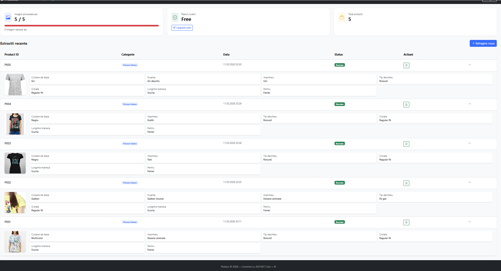 |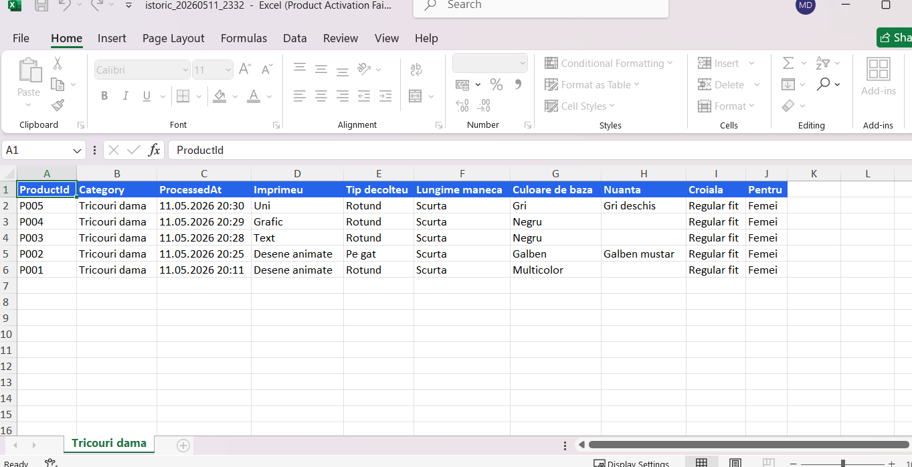  |

| Payment -Stripe | Dashboard — Pro plan |
|---|---|
| 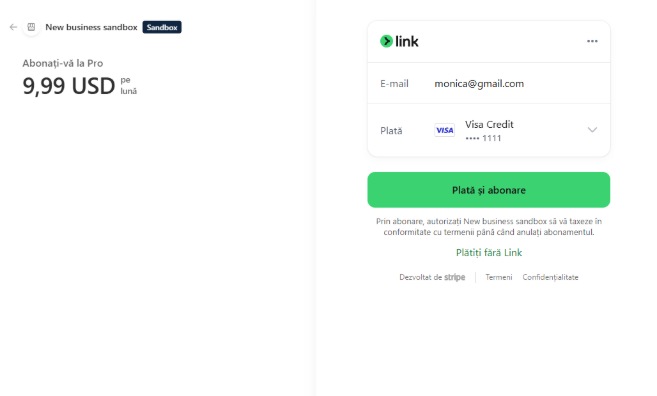 | 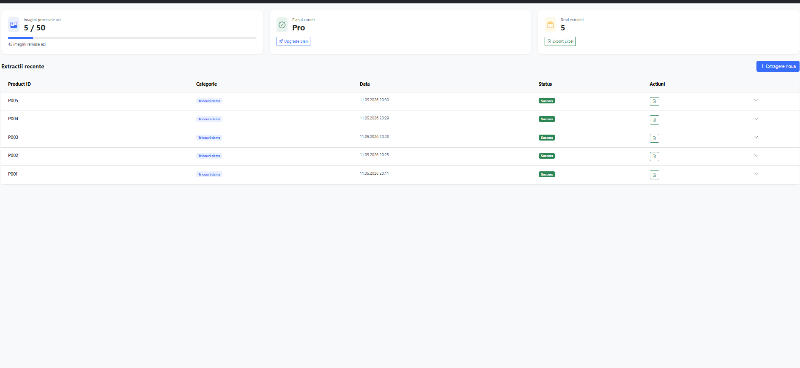 |


| Downgrade confirmation modal | Admin Dashboard |
|---|---|
| 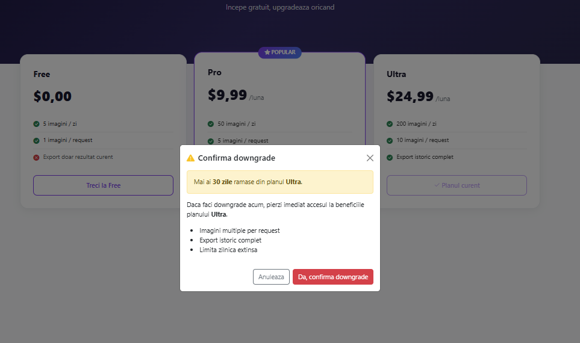 |  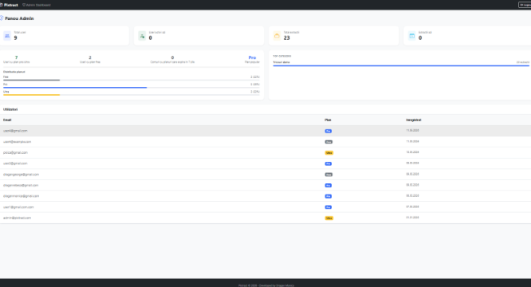 |


### Swagger API

| Overview | Register endpoint |
|---|---|
| 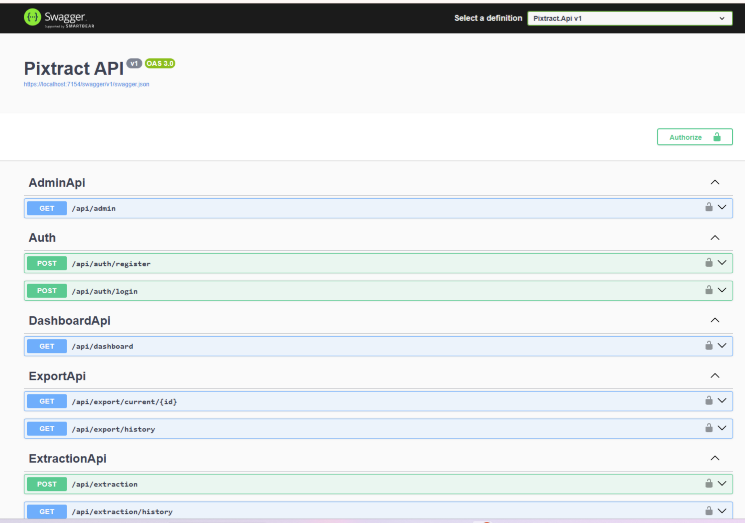 | 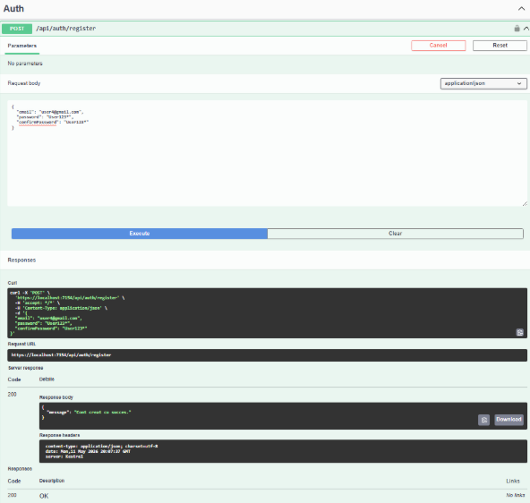 |

| Login | Available authorizations |
|---|---|
| 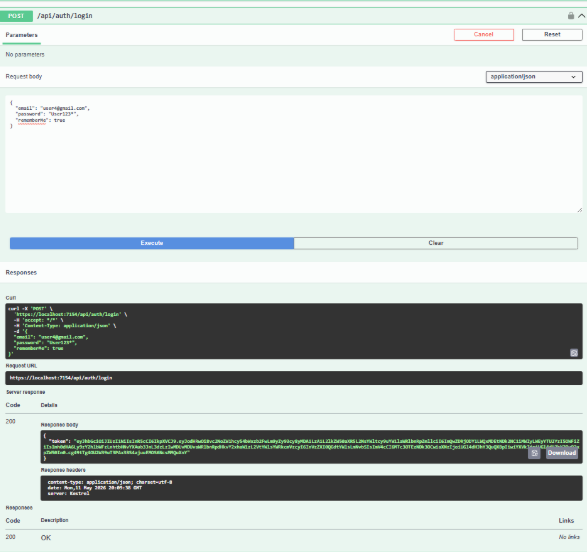 | 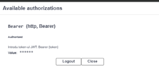 |

Used token: `eyJhbGciOiJIUzI1NiIsInR5cCI6IkpXVCJ9...` (test token, expired)


|Extraction endpoint| Used image|
|---|---|
| 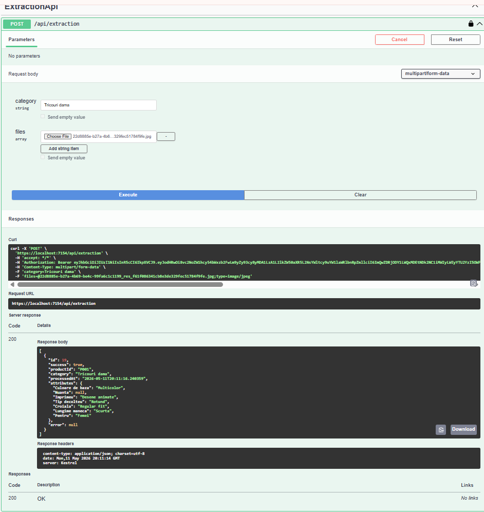 |  |

|Export endpoint| excel|
|---|---|
| 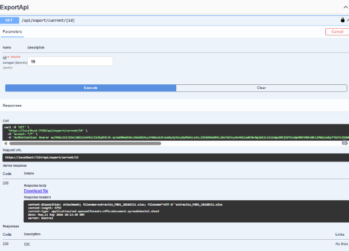 | 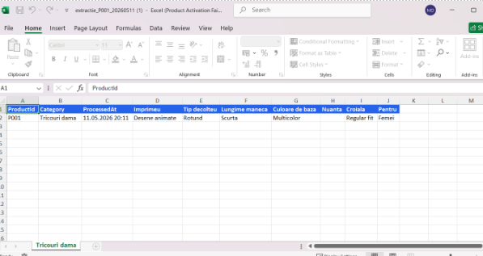 |


| Subscription endpoint | Dashboard endpoint |
|---|---|
| 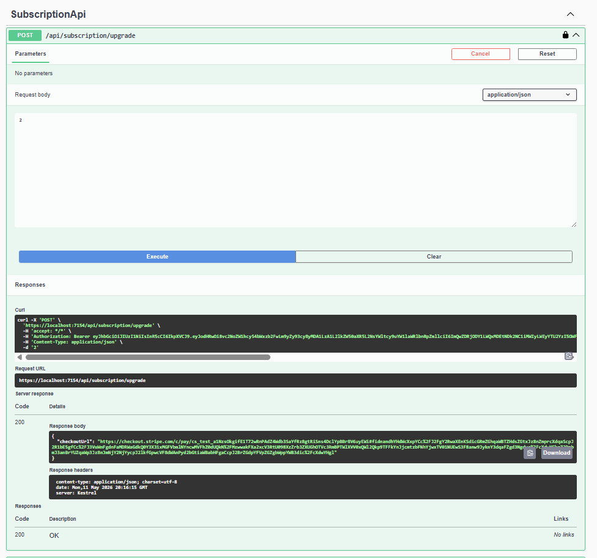 | 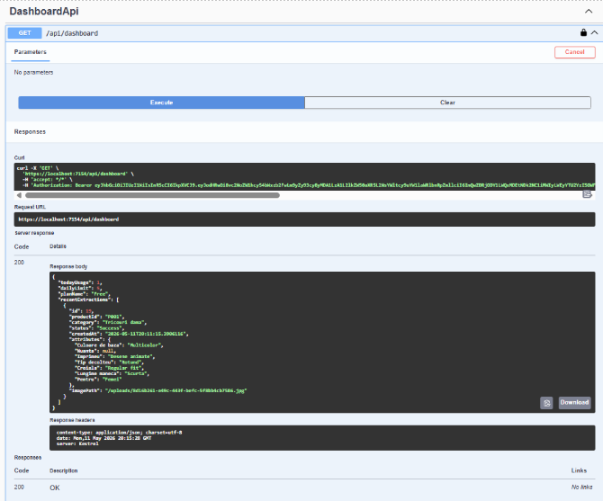 |

### 🐍 Python AI Service (Google Colab)

| Colab running | Health check |
|---|---|
| 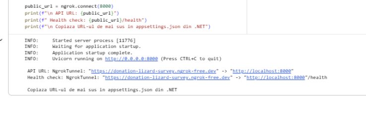 | 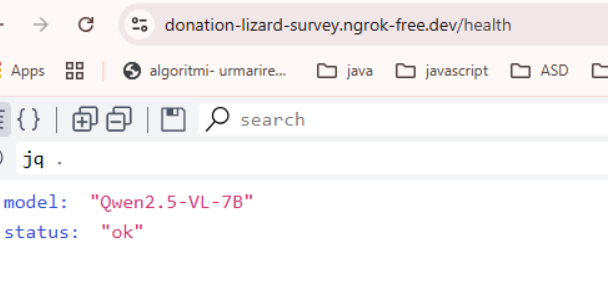 |

---

## 🏗️ Architecture

Pixtract follows **Clean Architecture** — a layered approach where each layer depends only on the layers beneath it. This keeps the business logic independent of the framework, database, and external services.

```
┌──────────────────────────────────────────────────────┐
│             Presentation Layer                       │
│  Pixtract.Web (MVC)    │   Pixtract.Api (REST API)   │
└───────────────────────┬──────────────────────────────┘
                        │
┌───────────────────────▼──────────────────────────────┐
│             Application Layer                        │
│       Pixtract.Application (DTOs + Interfaces)       │
└───────────────────────┬──────────────────────────────┘
                        │
┌───────────────────────▼──────────────────────────────┐
│             Infrastructure Layer                     │
│   Pixtract.Infrastructure (Services + EF Core)       │
└───────────────────────┬──────────────────────────────┘
                        │
┌───────────────────────▼──────────────────────────────┐
│               Domain Layer                           │
│         Pixtract.Domain (Entities + Enums)           │
└──────────────────────────────────────────────────────┘
```

**Two separate applications share the same Infrastructure and Domain:**

- 🌐**Pixtract.Web** — MVC frontend using cookie-based authentication. Communicates with the API via a typed `ApiClient` HTTP client.
- ⚙️**Pixtract.Api** — REST API backend using JWT authentication. This is the layer that talks to the database and the Python AI service.

---

## 🛠️ Tech Stack

### Backend (.NET)

| Technology | Purpose |
|---|---|
| ASP.NET Core 8.0 | Web framework (MVC + REST API) |
| Entity Framework Core 8.0 | ORM — database access and migrations |
| ASP.NET Core Identity | User management, password hashing |
| JWT Bearer Authentication | API token-based auth |
| Cookie Authentication | Web session auth |
| Stripe.net | Payment processing and subscription management |
| ClosedXML | Excel file generation (.xlsx export) |
| Serilog | Structured logging (console + file + Seq) |
| IHttpClientFactory | HTTP client for calling the Python API |
| BackgroundService | Scheduled task for plan expiration checks |
| SQL Server (LocalDB) | Database |
| Swagger / Swashbuckle | API documentation |

### 🐍 AI Service (Python)

| Technology | Purpose |
|---|---|
| FastAPI | REST API framework for the AI service |
| Uvicorn | ASGI server |
| Qwen2.5-VL-7B-Instruct | Vision-language model (from Hugging Face) |
| Transformers (HuggingFace) | Model loading and inference |
| PyTorch (bfloat16) | GPU inference with reduced memory usage |
| Pillow | Image preprocessing (resize, convert) |
| pyngrok | Expose local Colab server to the internet |
| Google Colab | Cloud GPU environment for model hosting |

---

## ✨ Features

- 🤖 **AI-powered attribute extraction** from product images, per category
- 📤 **Single and batch image upload** (up to plan limit per request)
- 📊 **Daily usage limits** enforced per user plan
- 💳 **Subscription plans** (Free, Pro, Ultra) with Stripe checkout
- 🔄 **Automatic plan downgrade** when subscription expires (background service)
- 📥 **Export to Excel** — current product or full history, grouped by category
- 🕓 **Extraction history** — paginated list of past extractions with image preview
- 🛡️ **Admin dashboard** — business metrics (total users, active today, extractions), subscription analytics (free vs paid, expiring soon, plan distribution), top categories, full user list with plan badges
- 🔐 **Role-based access** — admin user seeded via EF migrations; JWT includes role claims; navbar and controllers restrict access by role
- ⚠️ **Downgrade confirmation modal** — warns user before switching to a lower plan
- 📝 **Structured logging** throughout all services
- ❤️ **Health check endpoint** on the Python API (`/health`)

---

## ⚙️ How It Works — End to End

```
User uploads image + selects category
        │
        ▼
Pixtract.Web (MVC Controller)
  - Reads file bytes and form data
  - Calls ApiClient.ExtractMultipleAsync()
        │
        ▼ HTTP POST (multipart/form-data + JWT)
Pixtract.Api (ExtractionApiController)
  - Authenticates request via JWT
  - Calls ExtractionService.ProcessMultipleAsync()
        │
        ▼
ExtractionService
  1. Validates file extension (.jpg .jpeg .png .webp)
  2. Validates file size (max 10MB)
  3. Checks daily usage limit via UsageService
  4. Generates product ID (P001, P002, ...) via UsageService
  5. Calls AiService.ExtractAsync()
        │
        ▼ HTTP POST (multipart/form-data)
Python FastAPI (/extract)
  - Reads image bytes
  - Preprocesses image (resize to 1024x1024, convert to base64)
  - Builds prompt: system rules + category-specific rules + allowed values
  - Calls Qwen2.5-VL-7B-Instruct model
  - Parses JSON from model output
  - Normalizes output (fixes keys, validates colors/shades)
  - Returns { success, productId, category, processedAt, attributes }
        │
        ▼
ExtractionService (continued)
  6. Saves image file to disk (/uploads/{guid}.jpg)
  7. Saves ExtractionRequest to database (ResultJson = serialized attributes)
  8. Increments user's daily usage counter
  9. Returns ExtractionResultDto to controller
        │
        ▼
Pixtract.Web
  - Displays extracted attributes to user
  - User can export to Excel or view history
```

---

## 🤖 AI Service (Python)

The AI service runs on **Google Colab** (GPU environment) and is exposed via **ngrok**. Its URL is configured in `appsettings.json` under `PythonApi:BaseUrl`.

### 🧠 Model

**Qwen2.5-VL-7B-Instruct** is a 7-billion parameter vision-language model. It receives both an image and a text prompt and returns a JSON response.

- Loaded in `bfloat16` to halve GPU memory usage with no significant quality loss
- `do_sample=False` + `temperature=0.1` makes responses deterministic
- `max_new_tokens=256` is sufficient for a small JSON response

### 🖼️ Image Preprocessing (`prepare_image`)

```
Raw image bytes
    → PIL.Image.open() → convert to RGB
    → thumbnail(1024x1024) — proportional resize, no cropping
    → save as JPEG (quality=85)
    → base64 encode
    → sent to model as data URI
```

### 📝 Prompt Construction (`build_prompt`)

Every model call has two parts:

**System prompt** (same for all categories):
- `GLOBAL_RULES` — general rules (return only JSON, never guess, null if not visible)
- `COLOR_RULES` — color and shade detection rules

**User prompt** (category-specific):
- `RULES_MAP[category]` — detailed field-by-field instructions (e.g., how to distinguish Polo from Henley, Slingback from Gladiator)
- Allowed values for `Culoare de baza` (16 base colors)
- Allowed shades per base color (`NUANTE`)

### 🔧 Output Normalization (`normalize_output`)

The model output goes through three cleanup steps:

1. **Key cleanup** — removes trailing `:` characters (a known Qwen formatting bug)
2. **List flattening** — if the model returns a list instead of a single value, takes the first element
3. **Color validation** — if `Culoare de baza` is not in the `NUANTE` dictionary, forces `Nuanta` to null (e.g., `Alb` has no shades, so `Nuanta` must be null)
4. **Character rule** — `Poveste/Personaj` is only valid when `Imprimeu` is `Desene animate`; otherwise forced to null

### 📦 JSON Parsing (`parse_json`)

The model sometimes wraps the JSON in extra text. The parser:
1. First tries `json.loads()` directly
2. If that fails, uses regex `\{.*\}` to extract the JSON block from the text

### 🔌FastAPI Endpoints

| Method | Path | Description |
|---|---|---|
| POST | `/extract` | Receives image + category + product_id, returns extracted attributes |
| GET | `/health` | Returns `{"status": "ok", "model": "Qwen2.5-VL-7B"}` |

---

## 💳 Subscription Plans

| Plan | Daily Image Limit | Images per Request | Can Export History | Price |
|---|---|---|---|---|
| 🆓 Free | 5 | 1 | No | $0 |
| ⭐ Pro | 50 | 5 | Yes | $9.99 |
| 🚀 Ultra | 200 | 10 | Yes | $24.99 |

**Plan enforcement:**
- `UsageService.CanProcessAsync()` checks today's usage before every extraction
- `PlanExpirationService` runs every 24 hours as a `BackgroundService` and downgrades expired paid users back to Free by setting `PlanId = freePlan.Id` and clearing `PlanExpiresAt`
- Paid plans expire 30 days after purchase

---

## 📁 Project Structure

```
Pixtract/
├── Pixtract/                          # MVC Web Application
│   ├── Program.cs                     # Cookie auth, session, HttpClient setup
│   ├── appsettings.json               # API base URL
│   ├── Client/
│   │   └── ApiClient.cs               # Typed HTTP client for all API calls
│   └── Controllers/
│       ├── AccountController.cs       # Login, Register, Logout
│       ├── AdminController.cs         # Admin dashboard
│       ├── DashboardController.cs     # User dashboard
│       ├── ExportController.cs        # Excel download
│       ├── ExtractionController.cs    # Upload and extract
│       ├── HomeController.cs          # Landing page
│       ├── PricingController.cs       # Plans page
│       └── SubscriptionController.cs  # Stripe checkout + confirm
│
├── Pixtract.Api/                      # REST API
│   ├── Program.cs                     # JWT auth, EF, Identity, Stripe, Swagger
│   ├── appsettings.json               # JWT key, Stripe keys, Python API URL
│   └── Controllers/
│       ├── AuthController.cs          # POST /api/auth/register, /login
│       ├── ExtractionApiController.cs # POST /api/extraction, GET /history
│       ├── SubscriptionApiController.cs # Stripe upgrade + confirm
│       ├── DashboardApiController.cs  # Dashboard stats
│       ├── PlansApiController.cs      # List plans
│       ├── UsageApiController.cs      # Usage info
│       ├── ExportApiController.cs     # Excel export
│       └── AdminApiController.cs      # Admin stats
│
├── Pixtract.Application/              # Contracts
│   ├── DTOs/                          # Data Transfer Objects
│   └── Interfaces/                    # Service interfaces
│
├── Pixtract.Domain/                   # Core business objects
│   ├── Entities/
│   │   ├── ApplicationUser.cs         # IdentityUser + PlanId + CreatedAt + PlanExpiresAt
│   │   ├── ExtractionRequest.cs       # One image extraction record
│   │   ├── Plan.cs                    # Subscription plan definition
│   │   ├── UserDailyUsage.cs          # Per-user per-day usage counter
│   │   └── BatchJob.cs                # Batch processing metadata
│   └── Enums/
│       ├── ExtractionStatus.cs        # Success, Failed
│       └── BatchStatus.cs             # Pending, Processing, Done, Failed
│
└── Pixtract.Infrastructure/           # Implementations
    ├── Data/
    │   ├── ApplicationDbContext.cs
    │   └── Configurations/            # EF Fluent API configs per entity
    ├── Services/                      # All IService implementations
    └── Config/
        └── DependencyInjection.cs     # Service registrations (Scoped)
```

---

## 🗄️ Database Schema

```
Plans
  Id (PK), Name, DailyImageLimit, ImagesPerRequest, Price, CanExportHistory

AspNetUsers (ApplicationUser)
  Id (PK), Email, UserName, PlanId (FK → Plans), CreatedAt, PlanExpiresAt, ...

ExtractionRequests
  Id (PK), UserId (FK → AspNetUsers), ProductId, Category,
  ResultJson, ImagePath, Status, CreatedAt

UserDailyUsages
  Id (PK), UserId (FK → AspNetUsers), Date, ImagesUsed

BatchJobs
  Id (PK), UserId (FK → AspNetUsers), Category,
  TotalImages, ProcessedImages, Status, CreatedAt
```

---

## API Endpoints

### 🔑 Auth
| Method | Route | Description |
|---|---|---|
| POST | `/api/auth/register` | Register new user |
| POST | `/api/auth/login` | Login, returns JWT token |

### 🖼️ Extraction
| Method | Route | Auth | Description |
|---|---|---|---|
| POST | `/api/extraction` | JWT | Upload images and extract attributes |
| GET | `/api/extraction/history` | JWT | Get user extraction history |

### 💳 Subscription
| Method | Route | Auth | Description |
|---|---|---|---|
| POST | `/api/subscription/upgrade` | JWT | Create Stripe checkout session |
| POST | `/api/subscription/confirm` | JWT | Confirm payment and activate plan |

### 📋 Plans
| Method | Route | Auth | Description |
|---|---|---|---|
| GET | `/api/plans` | JWT | Get all available plans |
| GET | `/api/plans/user` | JWT | Get current user's plan |

### 📊 Dashboard
| Method | Route | Auth | Description |
|---|---|---|---|
| GET | `/api/dashboard` | JWT | Get today's usage, limit, plan, recent extractions |

### 📈 Usage
| Method | Route | Auth | Description |
|---|---|---|---|
| GET | `/api/usage` | JWT | Get images per request limit |

### 📥 Export
| Method | Route | Auth | Description |
|---|---|---|---|
| GET | `/api/export/current/{id}` | JWT | Export one extraction to Excel |
| GET | `/api/export/history` | JWT | Export full history to Excel |

### 🛡️ Admin
| Method | Route | Auth | Description |
|---|---|---|---|
| GET | `/api/admin` | JWT | Users, extractions, active today, expiring soon, top categories |

---

## 🔐 Authentication

Pixtract uses a **dual authentication strategy**:

### API (JWT)
- Users call `POST /api/auth/login`
- `AuthService` verifies credentials via `UserManager` and generates a JWT token
- Token contains: `NameIdentifier` (userId), `Email`, `Role` (Admin / User)
- Token expires in 7 days
- All protected API routes require `Authorization: Bearer <token>`

### Web (Cookie + Session)
- `AccountController` calls `ApiClient.LoginAsync()`, which calls the API
- The returned JWT is stored in the **ASP.NET Session** (server-side, 7-day idle timeout)
- A cookie is also created via `HttpContext.SignInAsync()` for MVC authorization checks; role claims are extracted from the JWT and added to the cookie so `User.IsInRole()` works in Razor views
- `ApiClient` reads the token from session and adds it to all outgoing API requests
- New users are automatically assigned the `User` role on registration; the admin user and `Admin` role are seeded via EF migrations

---

## ⚠️ Demo Limitations

This project was built as a proof-of-concept. The following limitations exist by design and would need to be addressed before any real deployment:

| Limitation | What it means | Production alternative |
|---|---|---|
| AI runs on Google Colab | Server stops when the Colab tab is closed; ngrok URL changes on every restart | Deploy model on a dedicated GPU server (e.g. Hugging Face Inference Endpoints, RunPod, AWS EC2 GPU) |
| ngrok tunnel | Public URL is temporary and changes on every Colab restart | Fixed domain with a real server |
| SQL Server LocalDB | Database lives only on the developer's machine | Azure SQL, PostgreSQL on a cloud server |
| Stripe test mode | No real payments are processed | Switch to live Stripe keys after going live |
| JWT secret in appsettings.json | Secret key is committed to the repo in plain text | Use environment variables or Azure Key Vault |
| Hardcoded upload path | `UploadPath` points to a local Windows path | Use a cloud storage bucket (e.g. Azure Blob Storage, AWS S3) |

---

## 🚀 Running the Project

### Prerequisites

- ✅ .NET 8 SDK
- ✅ SQL Server (LocalDB is included with Visual Studio)
- ✅ Stripe account (test keys work)
- ✅ Google Colab (A100) for the Python AI service
- ✅ ngrok account (free tier works)

### Steps

**1. Database setup**

```bash
# From Pixtract.Api directory
dotnet ef database update
```

**2. Configure secrets**

Edit `Pixtract.Api/appsettings.json`:
```json
{
  "PythonApi": {
    "BaseUrl": "https://your-ngrok-url.ngrok-free.dev"
  },
  "Stripe": {
    "SecretKey": "sk_test_...",
    "ProPriceId": "price_...",
    "UltraPriceId": "price_...",
    "WebBaseUrl": "https://localhost:XXXX"
  },
  "Jwt": {
    "Key": "your-secret-key-here"
  }
}
```

**3. Start the Python AI service**

Open `cod_pixtract.py` in Google Colab, run all cells. Copy the ngrok URL printed at the end and paste it into `PythonApi:BaseUrl` in `appsettings.json`.

**4. Start the .NET applications**

```bash
# Terminal 1 — API
cd Pixtract.Api
dotnet run

# Terminal 2 — Web
cd Pixtract
dotnet run
```

**5. Open the app**

Navigate to `https://localhost:XXXX` (or the port shown in terminal).

Swagger UI is available at `https://localhost:ZZZZ/swagger`.

---

## ⚙️Configuration

| Key | Location | Description |
|---|---|---|
| `ConnectionStrings:DefaultConnection` | Api + Web `appsettings.json` | SQL Server connection string |
| `Jwt:Key` | Api `appsettings.json` | Secret key for JWT signing |
| `Jwt:Issuer` | Api `appsettings.json` | JWT issuer claim |
| `Jwt:Audience` | Api `appsettings.json` | JWT audience claim |
| `PythonApi:BaseUrl` | Api `appsettings.json` | ngrok URL of the Python AI service |
| `Stripe:SecretKey` | Api `appsettings.json` | Stripe secret key |
| `Stripe:ProPriceId` | Api `appsettings.json` | Stripe price ID for Pro plan |
| `Stripe:UltraPriceId` | Api `appsettings.json` | Stripe price ID for Ultra plan |
| `Stripe:WebBaseUrl` | Api `appsettings.json` | Base URL for Stripe redirect after payment |
| `UploadPath` | Api `appsettings.json` | Absolute path where uploaded images are saved |
| `ApiSettings:BaseUrl` | Web `appsettings.json` | Base URL of the REST API |

---


